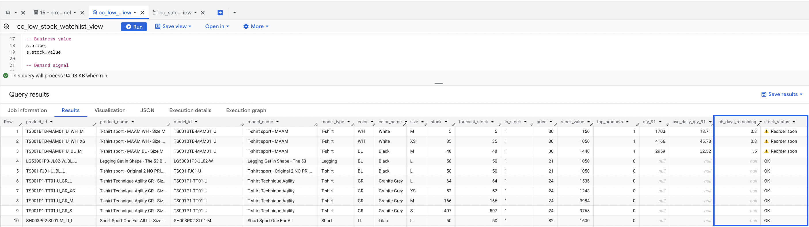

# 02 — Aggregation & SQL Pivot Table

This challenge builds on the enriched `circle_stock_kpi` table from 01 - inventory.  
It focuses on summarizing KPIs and analyzing **top-selling products** to help the purchasing team:  

- **Control stockouts** by monitoring shortage rates.  
- **Anticipate future sales** by linking stock with sales velocity.  
- **Prioritize reorders** for products with low forecast coverage.  

---

## 📥 Source Data

- The enriched `circle_stock_kpi` table from Challenge 1
- `circle_sales` table

---

## 📝 Run Notes

### 1) Stock Aggregation
- Calculated KPIs globally and by `model_type`:  
  - Total products  
  - Products in stock  
  - Shortage rate (`COUNTIF(in_stock=0)/COUNT(*)`)  
  - Total stock value (`SUM(stock_value)`)  
  - Total stock quantity (`SUM(stock)`)  
- Extended aggregation by (`model_type`, `model_name`) and sorted by stock value.  
- Outputs: insight into where shortages and value are concentrated.  

### 2) Sales Aggregation
- Identified **top 10 products** by total sales quantity → stored in `top_products`.  
- Flagged them in stock table via new column `top_products` → saved as `circle_stock_kpi_top`.  
- Aggregated 91-day sales window (July–Sept 2021):  
  - `qty_91` = total units sold in last 91 days  
  - `avg_daily_qty_91` = average daily sales  
  - Saved in `circle_sales_daily`.  
- Cross-joined with `circle_stock_kpi_top` to estimate **days of stock remaining** (`nb_days_remaining = forecast_stock / avg_daily_qty_91`) for top products with low stock (<50 units).

---

## 📑 Deliverables

- **Tables**
  - *(Intermediate)* `top_products` → temporary table identifying the 10 most-sold products.  
  - [circle_stock_kpi_top](https://docs.google.com/spreadsheets/d/19Tw8Q3HP5bCgRVrJ7VsR0OsAth86miYG8Ux3HhxS_z8/edit?usp=sharing) → enriched with a `top_products` flag (0/1).  
  - [circle_sales_daily](https://docs.google.com/spreadsheets/d/1UTFFqD0voY8s2By2f3SULKNQgTawtz1QulDBdga1bNA/edit?usp=sharing) → sales aggregation over the last 91 days (`qty_91`, `avg_daily_qty_91`).  

- **Analytical outputs**  
  - Aggregated KPIs by `model_type` and `model_name`.  
  - Low-stock watchlist with estimated `nb_days` of stock remaining.
  - Risk flag (`stock_status`: OK / Low stock / ⚠️ Reorder soon)

---

## ⚡ *Advanced SQL Extension — Views vs. Tables*

*Later, I revisited this challenge to practice the trade-off between **views** and **tables***.  

- *Created `cc_sales_daily_view` → a view version of the 91-day rolling sales query.*  
- *Compared it with the table `circle_sales_daily` to evaluate performance and cost.*  
- *Findings:*  
  - Views ensure **always up-to-date results** but re-scan raw sales data.  
  - Tables reduce **query cost and runtime** by materializing results — useful when data refreshes only once per day.  

*This exercise reinforced the hybrid strategy: use views for freshness, tables for heavy/slow queries where hourly updates aren’t needed.*  

---

## 🎯 Result
The purchasing team now has:  
- A global and segmented view of stock health.  
- Visibility into top sellers and their stock coverage.  
- A **low-stock watchlist** that highlights products at risk of running out soon.  
- A **decision-ready query** that prioritizes urgent reorders.  
